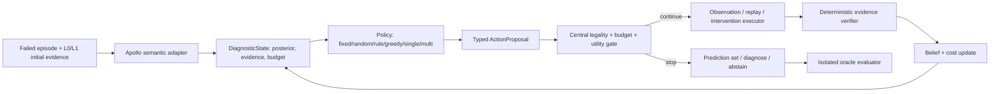

# CAGE-AD Apollo D0 主动诊断系统设计

> Status: `IMPLEMENTATION-READY / SCIENTIFIC-CLAIMS-PROVISIONAL`  
> Starting point: Apollo 10 + CARLA 0.9.15 G0=`APOLLO_GO`  
> Scope: 先完成 Apollo-only D0-A；Autoware D0-B 在 Apollo gate 之后复刻  
> Core rule: D0 的成功是完成无泄漏、可比较、可复现的实验，不是强制 Agent 赢得结果

## 1. 目标与边界

### 1.1 D0-A 的工程目标

把 G0 已验证的一个固定 O1 查询和一个固定 I2 干预，升级为完整的顺序诊断系统：

1. 接收一个失败 episode、初始 L0/L1 证据、合法动作目录和预算；
2. 维护责任域后验、证据账本、动作成本和剩余预算；
3. 由统一 policy 接口顺序选择 observation/intervention；
4. 由确定性 verifier 验证工具、权限、provenance 和副作用；
5. 更新后验并决定继续、诊断或拒答；
6. 在同一 benchmark、同一工具和同一预算下比较非 Agent、Single-Agent 和 structured Multi-Agent。

### 1.2 科学目标

优先检验核心 H1：病例自适应获证能否在相同 selective risk/coverage 下比 fixed panel 降低证据成本，并经受 greedy Bayesian 对照。

Multi-Agent 是条件性 H4，不是 D0-A 的成功前提。若同预算不优于 Single-Agent，系统仍算实现完成，但论文不把 Multi-Agent 列为贡献。

### 1.3 D0-A 明确不做

- 不搭 Autoware；
- 不宣称跨栈泛化；
- 不做 perception fault、真实车辆、代码级定位或自动修复；
- 不把 CARLA simulator truth 暴露给诊断 policy；
- 不使用 I3 perfect-state replacement 作为主方法；
- 不将多个 Agent 投票当作 posterior；
- 不用 LLM 自报 confidence 触发拒答；
- 不为了得到正结果修改 fault label、预算或 split。

## 2. G0 起点与 D0 缺口

### 2.1 已验证底座

- Apollo 10 `application-pnc` + CARLA 0.9.15 host-mode 闭环；
- rendered synchronous CARLA、RGB/LiDAR、Town01 map/bridge；
- planning/control live topics 与 clean startup/shutdown；
- `tracking_execution` L1 observation；
- `control_target` 非 GT I2 brake probe；
- measured cost、run manifest、evidence ID 和 physical oracle isolation；
- 三次重复与 clean-shell replay。

### 2.2 尚未实现

- 多个责任域与多个可混淆根因；
- 动作目录与 legality/cost registry；
- `DiagnosticState`、后验和 belief update；
- expected information gain；
- fixed/random/rule/greedy Bayesian；
- Single-Agent/Multi-Agent action selection；
- calibration、prediction set 与 abstain；
- grouped train/calibration/test protocol；
- risk–cost evaluation。

## 3. D0 分阶段规模

### D0-A0：12-episode feasibility smoke

```text
1 stack × 3 responsibility domains × 2 mechanisms
× 2 scenario templates × 1 seed = 12 failed diagnosis episodes
```

通过条件：12 个失败均可重复触发；每个 episode 有合法 O0/O1；三类 responsibility label 不从名称、路径、时间戳或 payload 泄漏；至少一个 mixed-action probe 可执行并记录副作用。

### D0-A1：36-episode Apollo pilot

```text
1 stack × 3 domains × 2 mechanisms
× 2 scenarios × 3 seeds = 36 failed diagnosis episodes
```

这里的 36 指供诊断评价的 fault episodes。配套 nominal run、fault confirmation run 和 evaluator-only repair/probe run 不计为独立诊断样本。

### D0-B：后续 Autoware replication

在冻结 Apollo contract、action semantics 和 split 后，将同一 36-episode 语义设计移植到 Autoware，最终形成 72 episodes。D0-B 不得反向修改 Apollo test label 或利用 target-stack test oracle 调 ontology。

## 3A. 数据集策略与来源分层

### 结论：主 benchmark 必须在当前栈上受控生成

D0 的主数据不是一般事故录像或静态日志集合，而是 **action-aware diagnosis episodes**。每个 episode 必须同时保存：

- 初始可见证据和 evaluator-private 根因；
- 当前条件下合法但尚未执行的 observation/intervention；
- 每次动作返回的新增证据、失败状态、副作用和实测成本；
- 动作前后的 posterior、prediction set、budget 和 stop decision；
- nominal、fault、wrong-domain probe 与 evaluator-only counterfactual 的对应关系。

现有论文 artifact 没有一套同时满足 Apollo 10、CARLA 0.9.15、上述动作目录、成本账本、oracle 隔离和后续 Autoware 语义配对，因此不能直接作为主 benchmark。主数据采用当前环境中的 scenario/fault generators 受控生成；这不是任意合成数据，而是由既有工作的场景和故障 taxonomy 约束、可重复执行的闭环诊断 benchmark。

### 三层数据来源

| Layer | 数据及用途 | 是否进入主 test | 使用边界 |
|---|---|---:|---|
| L-A：主 benchmark | 自建 `CAGE-AD-D0`：Apollo 10 的 12-episode smoke → 36-episode pilot；后续镜像为 Autoware 36 episodes | 是 | 评价主动获证、成本、拒答和 Single/Multi；GT 由注入边界与反事实检查建立 |
| L-B：外部协议/复现集 | ADSDx 5 个公开示例、ACAV 可获得记录/代码、后续可选 HINT cases | 否，单独报告 | 验证 adapter、fault/action schema 和强 Baseline；不同栈版本、标签、工具权限的数据不得混入主 split |
| L-C：ontology/template sources | HINT、Minimal Grey Box、ADSDx、ACAV、ROCAS、MoDitector 的故障族；1331 个 Apollo/Autoware bug-fix benchmark；Leveraging Modular Architecture 的 bug/issue 分析 | 否 | 构造责任域、场景和 fault templates；不能把文本/issue 标签当作运行时诊断证据 |

### 已调研数据的具体可用性

| 工作 | 已知规模/形态 | D0 中可复用内容 | 不能直接承担的角色 |
|---|---|---|---|
| HINT | 72 cases；Apollo 9 + CARLA 0.9.14；完整包约 8.69 GB，当前未下载 | 白盒 Agent baseline、case/fault taxonomy、工具设计参考 | Apollo 10 主数据；低权限公平比较；跨栈结论 |
| Minimal Grey Box | 6 场景、4D fault space、1099 trajectories；本地 artifact 主要是 Apollo–VTD bridge/injector | 少信息诊断对照、故障参数和场景思路 | 完整 BN/FT/MCS/DBN 复现；VTD-free 主 benchmark |
| ADSDx | 论文报告 22 faults、93 accidents；公开包当前可见 5 个 demo cases | 5-case adapter smoke、Apollo/Autoware 故障模式、ADSDx-style upper bound | 完整 93-case 训练/测试集；Apollo 10/CARLA 主数据 |
| ACAV | 官方页面报告 110 accident recordings、1206 injected-fault recordings，并公开源码仓库 | Apollo 因果分析外部复现、fault taxonomy、可能的静态外部测试 | 尚未核实全部 1206 raw records 可直接取得；无成本感知顺序动作轨迹 |
| ROCAS / MoDitector | 事故根因/模块诱导场景生成研究 | failure templates、搜索或注入 Baseline | 当前没有可直接接入 Apollo 10 的完整本地数据资产 |
| Bug-Fix Patterns / Leveraging Modular Architecture | 1331 bug fixes；3078 bugs/20680 issues | 责任域 ontology、真实缺陷分布和 held-out template 设计 | 闭环驾驶 episode 或主动诊断工具结果 |
| DiaVio / nuScenes 等 | 文本事故报告或感知数据 | 以后扩展 L0/perception 的可能来源 | 本论文 PnC 内部根因与 intervention benchmark |

### 数据生成、划分与发布规则

1. D0-A0 只生成 12 个 smoke episodes；通过稳定性和泄漏审计后才生成 D0-A1 的 36 个正式 episodes。
2. 所有 fault templates、scenario parents、参数 envelope 和 split 在正式批量运行前冻结并提交 Git。
3. 以 `semantic_fault_template + scenario_parent` 分组；参数变体和 seed 不得跨 train/calibration/test。
4. 主结果以每个 policy 对同一批 episode 的顺序交互轨迹为单位；不得把一次 episode 的多个 query 当作独立样本。
5. 生成器、manifest、schema、split、small semantic evidence 和摘要结果进入 GitHub；raw sensor、bag、视频、private oracle 留在 AutoDL/object storage。
6. 论文中将该数据称为受控闭环 benchmark，不能宣称代表开放道路全部故障分布；真实 bug sources 仅提高模板依据，不会自动带来生态有效性。
7. 若外部 artifact 的许可证允许，发布 adapter 和复现脚本，不重新分发原始第三方数据。
8. 旧 `Zhijia-Guardian` 的 manual/CARLA/nuScenes/nuPlan 数据和 Multi-Agent 结果不进入 CAGE-AD 默认依赖、回归测试或主结果；若以后做历史原型对照，必须作为独立外部实验并明确任务差异。

### 数据策略的科学意义

自行生成主 benchmark 不是工程负担的偶然结果，而是核心实验条件：固定日志不能回答“在预算内下一步应该买哪项证据”，因为未执行动作的反事实结果和实际成本不存在。只有 action-aware generator 能在相同 episode、相同工具和相同预算下比较 fixed、greedy、Single-Agent 与 Multi-Agent。

### 可核验来源入口

- ADSDx artifact：[Zenodo record 17847407](https://zenodo.org/records/17847407)
- ACAV 数据规模与源码入口：[official project page](https://acav2023.github.io/)；[public source repository](https://github.com/acav2023/ACAV-SourceCode)
- Apollo/Autoware bug-fix benchmark：[arXiv:2502.01937](https://arxiv.org/abs/2502.01937)
- HINT 论文版本与原始设定：[arXiv:2607.12598](https://arxiv.org/abs/2607.12598)

## 4. 端到端系统



### Challenge → mechanism → experiment → claim

| Challenge | Mechanism | D0 experiment | Allowed claim if passed |
|---|---|---|---|
| 固定日志对不同故障价值不同 | 顺序获证 + shared budget | fixed/random/greedy/adaptive risk–cost | 在 Apollo D0 benchmark 上降低 evidence cost |
| 证据工具异构 | typed semantic actions + verifier | illegal/repeat/tool-failure audit | 工具调用可审计、可控 |
| 低预算时根因可能等价 | calibrated prediction set/abstain | ambiguity pairs + matched coverage | 降低错误 singleton attribution |
| specialist 可能互补也可能浪费 | shared-state Multi-Agent + central gate | equal-budget Single/Multi | 仅在显著改善时宣称 coordination gain |

## 5. 责任域与语义槽

D0-A 只评价三个责任域：

| Domain | Contract responsibility | Minimum semantic slots |
|---|---|---|
| `interaction_forecasting` | 对参与者未来状态/意图作时序预测 | `observed_actor_history`, `predicted_actor_trajectories` |
| `motion_planning` | 在规则、障碍和动力学约束下产生 ego motion plan | `behavior_intent`, `motion_plan`, `safety_constraints` |
| `tracking_execution` | 将 motion target 转为 actuator command 并跟踪 | `control_target`, `vehicle_response` |

Apollo native topic/module 名只能写入 adapter provenance；policy、label 和主指标只能使用上述 contract IDs。

当前 G0 empty-road heartbeat 不足以评价 prediction/planning fault。D0-A 必须增加可重复交互 actor。允许 benchmark adapter 使用 CARLA actor truth 构造 Apollo 的“理想 perception 输入”，但必须满足：

- 仅作为被测 PnC 栈的输入；
- diagnosis-visible evidence 不包含 actor IDs、injector flags 或 simulator oracle；
- 不评价 perception responsibility；
- 报告明确限定为 perfect-perception PnC benchmark。

## 6. Scenario 与 fault benchmark

### 6.1 两个 scenario templates

1. `lead_vehicle_deceleration`：同车道前车减速/停车，考验 prediction、规划减速和控制跟踪。
2. `cut_in_or_crossing_actor`：相邻车道切入或横向穿越，考验轨迹预测、约束规划和响应执行。

每个模板固定地图区域、初始 pose、route、actor behavior envelope 和成功/失败判据；seed 只改变预注册的小范围速度/启动时刻，不改变故障语义。

### 6.2 六个 fault mechanisms

| Domain | Fault A | Fault B | Semantic injection boundary |
|---|---|---|---|
| Forecasting | delayed/stale predicted trajectory | biased heading/maneuver trajectory | `predicted_actor_trajectories` output |
| Planning | obstacle/safety constraint omitted | unsafe speed/trajectory-cost bias | planning constraint/input or `motion_plan` output boundary |
| Tracking | control command transport delay | gain/saturation/tracking bias | `control_target` before CARLA actuation |

实现要求：

- fault config、injector state 和 label 只能位于 evaluator-private 路径；
- diagnosis-visible IDs 使用随机 opaque IDs；
- 文件名、scenario ID、时间戳、slot ordering 和 payload 字段不得编码 fault family；
- 每个 fault 必须有 nominal run、fault-effect confirmation 和 evaluator-only counterfactual check；
- downstream symptom 不自动等于 root responsibility；label 由 injection boundary + counterfactual check 确认；
- 一个 episode 暂只允许一个主导 fault。

### 6.3 Failure criteria

至少包含一个安全/任务失败判据和一个中间机制判据：

- collision / minimum TTC violation / route failure；
- prediction deviation、plan constraint violation 或 tracking lag/bias；
- fault effect 在至少 2/3 重复中超过预注册阈值；
- nominal run 不应触发同一失败。

阈值必须根据 D0-A0 nominal/fault distribution 冻结后再运行 D0-A1，不能在 test 结果后调节。

### 6.4 Grouped split

主要 group key：

```text
semantic_fault_template + scenario_parent
```

同一 group 的 seed/参数变体不能跨 train/calibration/test。D0-A 只有 12 个 semantic groups，主要用于工程 pilot 和 grouped cross-validation；不得从 36 行把样本量夸大成 36 个独立 fault templates。最终显著性与强 calibration claim 需要扩充 group 数。

## 7. Action Catalog v0

| ID | Type | Regime | Behavior | Main cost |
|---|---|---|---|---|
| O0 | passive observation | L0 | failure window、ego/event summary | bytes/access |
| O1 | active query | L1 | 请求一个 semantic slot 的 bounded window/summary | bytes/latency |
| O2 | privileged query | L2 | 请求 native timing/rate/dependency metadata | access/private fields |
| O3 | experimental observation | L1/L2 | 相同 episode 重放并补采一个 slot | runtime/compute |
| I2-F | intervention | R2 | 用 actor history 的 constant-velocity forecast 作非 GT prediction probe | risk/runtime |
| I2-P | intervention | R2 | 用 deterministic safety-envelope plan 作 planning-boundary probe | risk/runtime |
| I2-C | intervention | R2 | bounded brake/zero-throttle control probe | risk/runtime |

I2 probes 是 targeted boundary normalization，不是“修好一切”的 oracle replacement。必须记录：

- probe 输入来源；
- 修改前/后中间信号；
- effect onset/latency；
- downstream side effects；
- wrong-domain negative probes；
- failure removal 和 false-repair rate。

如果任意下游刹车都能避免事故，不能据此把 control 判为根因。

I1 scenario mutation 和 I3 GT replacement 不进入 D0-A 主方法；I3 以后只作 ADSDx-like upper bound。

## 8. 核心类型接口

### 8.1 `EpisodeSpec`

```json
{
  "episode_id": "opaque_uuid",
  "stack": "apollo_10",
  "scenario_template": "opaque_scenario_group",
  "failure_type": "collision_or_safety_violation",
  "failure_window": {"start_s": 0.0, "end_s": 0.0},
  "observable_regime": "L1",
  "initial_evidence_refs": [],
  "allowed_action_ids": [],
  "budget_profile": "B1",
  "seed": 0
}
```

Diagnosis view 不含 `responsibility_domain`、fault name、injector path、oracle refs 或 split parent。

### 8.2 `DiagnosticState`

```json
{
  "episode_id": "opaque_uuid",
  "step": 0,
  "candidate_domains": ["interaction_forecasting", "motion_planning", "tracking_execution"],
  "posterior": {},
  "prediction_set": [],
  "evidence_ledger": [],
  "executed_actions": [],
  "remaining_budget": {},
  "mapping_uncertainty": {},
  "tool_failures": [],
  "status": "CONTINUE"
}
```

### 8.3 `ActionProposal`

```json
{
  "proposal_id": "uuid",
  "proposed_by": "policy_or_specialist_id",
  "action_id": "O1_query_motion_plan",
  "target_hypotheses": ["motion_planning", "interaction_forecasting"],
  "predicted_outcome_partitions": [],
  "required_regime": "L1",
  "action_type": "observation",
  "rationale_evidence_ids": [],
  "requested_parameters": {},
  "self_reported_confidence": null
}
```

Policy 不得提交自定义数字 IG 作为事实。IG 和 affordability 由 central coordinator 使用训练数据、已测成本和当前 posterior 计算。

### 8.4 `VerifiedEvidence`

```json
{
  "action_id": "O1_query_motion_plan",
  "evidence_id": "opaque_uuid",
  "semantic_slot": "motion_plan",
  "provenance": "apollo_semantic_adapter",
  "tool_success": true,
  "schema_valid": true,
  "permission_valid": true,
  "side_effects": [],
  "measured_cost": {
    "access": "L1",
    "bytes": 0,
    "runtime_seconds": 0.0,
    "compute_seconds": 0.0,
    "human_minutes": 0,
    "risk": 0,
    "tokens": 0,
    "api_cost_usd": 0.0
  },
  "payload_ref": "content_addressed_ref",
  "payload_sha256": "sha256"
}
```

### 8.5 `DiagnosisResult`

```json
{
  "episode_id": "opaque_uuid",
  "decision": "diagnose_or_abstain",
  "prediction_set": [],
  "posterior": {},
  "selective_risk_estimate": null,
  "supporting_evidence_ids": [],
  "contradicting_evidence_ids": [],
  "executed_actions": [],
  "total_cost": {},
  "stop_reason": "risk_met_non_identifiable_insufficient_budget_or_tool_failure",
  "audit_status": "VERIFIED"
}
```

Oracle evaluator 在诊断进程退出后添加 GT、correctness 和 counterfactual metrics；不得修改 diagnosis result。

## 9. Cost 与预算

### 9.1 原始成本向量

```text
access level, bytes, signals, replay count, intervention count,
runtime, compute, human time, risk, tokens, API monetary cost
```

原始物理量必须永久保存。标量 score 只能用于 action ranking，不能替代多维结果报告。

### 9.2 Pilot budget profiles

| Budget | Allowed behavior | Purpose |
|---|---|---|
| B0 | O0 only | 无额外证据下的可辨识性下界 |
| B1 | 最多 1 次 O1，总新增数据 ≤512 KiB | 低权限最小主动查询 |
| B2 | 最多 3 次 O1/O2，总新增数据 ≤1.5 MiB，无 intervention | observation-only 主档 |
| B3 | B2 + 最多 1 次 O3 + 1 次 I2，risk≤2 | mixed-action 主档 |
| B4 | full legal evidence panel | fixed-full 上界，不视为免费 |

Token/API 上限在 D0-A0 profiling 后冻结；Single/Multi 使用同一 episode 总 token、调用次数、模型、temperature 和超时，不按 Agent 数扩容。

## 10. Belief、IG 与 stopping

### 10.1 Deterministic feature extractor

每个 semantic slot 输出固定的时序/机制特征和 missing mask，例如：delay、timestamp jitter、trajectory deviation、constraint violation、tracking error、TTC response。LLM 不直接读取 evaluator-private raw data，也不能自由定义 test-time 特征。

### 10.2 Belief engine

D0 首版使用简单、可审计的 empirical/Bayesian outcome model：

1. 从 train groups 估计每个 domain/action 的 outcome likelihood；
2. 使用 smoothing 防止零概率；
3. acquired evidence 后执行统一 posterior update；
4. 所有 policy 共用同一 belief engine；
5. policy 只能影响“买哪项证据”，不能获得更强 classifier。

可增加 masked logistic baseline，但不能让 Agent 方法独享更强 predictor。

### 10.3 Expected information gain

```text
IG(a | h) = H[p(r | h)] - E_o H[p(r | h, a, o)]
utility(a) = IG(a | h) - cost_penalty(a)
```

期望分布来自训练/calibration groups 或预注册模拟，不由 LLM 随口估计。Oracle-IG 只在 evaluator 中作不可部署上界。

### 10.4 Stop controller

终止条件：

- calibrated risk 达标；
- 所有合法动作不可负担；
- best remaining expected value 低于阈值；
- prediction set 仍为多域且已无区分动作；
- tool failure 使必要证据不可得。

D0 对照至少包含：never-abstain、max-prob threshold、temperature-scaled threshold、prediction set/action-aware stop。

## 11. Policy 与 Agent 架构

所有方法实现统一接口：

```python
class DiagnosticPolicy(Protocol):
    def propose(self, state: DiagnosticState, catalog: ActionCatalog) -> list[ActionProposal]: ...
```

### 11.1 必须先实现的非 Agent policy

1. `fixed_full`
2. `fixed_minimal`
3. `random_legal`
4. `rule_tree`
5. `greedy_bayesian`
6. `oracle_ig`（evaluator-only upper bound）

### 11.2 Single-Agent

一个 Agent 接收完整 shared state、同一 tool schema 和有限 action catalog，只输出 typed proposals。Agent 不执行工具、不更新 posterior、不决定最终 correctness。

### 11.3 Structured Multi-Agent

- Forecasting Specialist；
- Planning Specialist；
- Control/Integration Specialist；
- central deterministic coordinator；
- deterministic evidence verifier。

specialists 可并行提议，但共享 episode 总 token/API/action budget。coordinator 只从 schema-valid、合法、可负担 proposals 中执行动作。消息不允许自由辩论。

### 11.4 Multi-Agent ablations

- equal-budget Single-Agent；
- Multi-Agent without central budget gate；
- structured Multi-Agent；
- structured Multi-Agent without verifier；
- static all specialists vs dynamic pruning；
- non-LLM specialists。

若 greedy Bayesian ≥ Agent，D0 仍完成；结论是 Agent contribution 被 kill，而不是继续调到赢为止。

## 12. Runtime state machine

```text
LOAD_EPISODE
→ BUILD_DIAGNOSIS_VIEW
→ INITIALIZE_BELIEF_AND_BUDGET
→ CHECK_STOP
→ POLICY_PROPOSE
→ VALIDATE_AND_SCORE_PROPOSALS
→ EXECUTE_ONE_ACTION
→ VERIFY_EVIDENCE_AND_COST
→ UPDATE_BELIEF
→ CHECK_STOP
→ ...
→ FREEZE_DIAGNOSIS_RESULT
→ ORACLE_EVALUATE_AFTER_PROCESS_EXIT
```

每步写 append-only event，支持 crash resume。重启后不得重复计费或重复执行有副作用的 intervention。

## 13. 推荐代码结构

所有新论文源码进入持久盘上的 `project/CAGE-AD` Git 仓库：

```text
CAGE-AD/
├── src/cage_ad/active_diagnosis/
│   ├── contracts.py
│   ├── state.py
│   ├── budget.py
│   ├── catalog.py
│   ├── belief.py
│   ├── stopping.py
│   ├── coordinator.py
│   ├── verifier.py
│   ├── runner.py
│   ├── policies/
│   │   ├── fixed.py
│   │   ├── random.py
│   │   ├── rules.py
│   │   ├── greedy_bayesian.py
│   │   ├── single_agent.py
│   │   └── structured_multi_agent.py
│   ├── agents/
│   │   ├── base.py
│   │   ├── forecasting.py
│   │   ├── planning.py
│   │   └── control.py
│   └── evaluation/
├── src/cage_ad/adapters/apollo_d0/
├── benchmarks/apollo_d0/
│   ├── scenario_registry.yaml
│   ├── fault_registry.yaml
│   ├── action_catalog.yaml
│   └── split_registry.yaml
├── configs/d0/
│   ├── budgets.yaml
│   ├── policies.yaml
│   ├── calibration.yaml
│   └── models.example.yaml
├── contracts/
├── deploy/autodl_apollo10/
├── scripts/d0/
├── tests/d0/
├── third_party/
│   ├── apollo_application_pnc/UPSTREAM.yaml
│   ├── carla_apollo_bridge/UPSTREAM.yaml
│   └── patches/
└── artifacts/g0/
    ├── APOLLO_G0_REPORT.md
    ├── versions.lock.yaml
    └── evidence_index.json
```

大文件继续留在 bundle `runtime/`；仓库通过环境变量/配置解析 runtime root，禁止把 `/root/autodl_apollo10_g0_bundle` 硬编码进 reusable modules。

## 14. Implementation gates

### Gate D0-0 — 新仓库与 Git/source checkpoint

- clone `git@github.com:LiPume/CAGE-AD.git`，初始化 `main` 后创建 `codex/apollo-d0-active-diagnosis`；
- G0 脚本、launch/config、contracts、bridge/Apollo patches 和本项目修改进入新仓库 private branch；
- 不导入旧 `Zhijia-Guardian` 的 Git 历史、数据、README 或产品原型代码；
- clean clone 能运行 unit/schema tests；
- 不含二进制、密钥、private oracle 或绝对 runtime 依赖。

### Gate D0-1 — Contracts and state engine

- 所有核心 JSON schema/Pydantic models；
- append-only ledger、budget atomicity、crash resume；
- oracle leakage/static path tests。

### Gate D0-2 — Benchmark smoke

- 12 episodes nominal/fault/counterfactual 通过；
- 三域、六机制、两场景均有覆盖；
- fault name/path/field leakage test 通过。

### Gate D0-3 — 36-episode Apollo pilot

- 三 seeds；
- split registry 冻结；
- 每个 episode 有完整 manifest、cost、visible evidence 和 evaluator-private oracle；
- 重复失败或 invalid episodes 原样计入，不静默删除。

### Gate D0-4 — Non-Agent baselines

- fixed/random/rule/greedy/oracle upper bound 全部在相同 runner 上运行；
- B0–B4 结果和 risk–cost curves 可生成；
- grouped evaluation 与 CI 实现。

### Gate D0-5 — Single/Multi-Agent

- provider-neutral client；密钥只从环境读取；
- typed proposals、token/API ledger、retry/timeout/tool-error handling；
- same-model/equal-budget audit 自动检查。

### Gate D0-6 — Calibration and final D0 decision

- calibration split/group fold 无泄漏；
- risk–coverage/AURC/Brier/ECE/prediction set；
- 运行 Kill Criteria K1/K3/K4/K5/K6；
- 输出 `D0_GO`、`D0_MODIFY` 或 `D0_NO_GO`，不得篡改结果制造 GO。

## 15. Evaluation protocol

### Primary

- selective risk vs cumulative evidence cost；
- cost at matched risk/coverage；
- Pareto dominance across B0–B4；
- wrong-singleton rate 与 correct-abstain rate。

### Secondary

- Top-1/MRR/prediction-set coverage/size；
- bytes、signals、replays、interventions、runtime、GPU、token、API cost；
- repeat query、illegal action、tool failure、Agent conflict；
- failure removal 与 false-repair rate。

### Statistical unit

fault-template/scenario group 是主要独立单位；seed 是组内重复。使用 paired grouped bootstrap 或 grouped cross-validation，报告 effect size 和 interval。D0-A 规模不足时只报告 descriptive/pilot evidence，不写显著性胜利结论。

## 16. Test and audit requirements

- schema round-trip/property tests；
- diagnosis view forbidden-key/path scan；
- evaluator-private permission test；
- budget cannot become negative；
- intervention idempotency and resume test；
- evidence checksum/provenance test；
- fixed/random reproducibility；
- equal-budget Single/Multi audit；
- prompt injection/irrelevant tool description stress test；
- no secret/.env/private oracle in Git；
- bridge and managed process cleanup；
- full command/run manifest and version lock。

## 17. Resource control

- 编码、unit test、offline evaluation 尽量在 CARLA/Apollo 停止时进行；
- 先跑 12-episode smoke，再扩 36，禁止一开始批量生成；
- episode 只保存 semantic payload 和失败 exemplar raw data；
- 大文件不进 Git；
- 每个 gate 记录 powered hours、disk 和失败重试；
- 新 D0 实验预算需单独记录，不能把 G0 已使用 18.9 小时隐藏掉。

建议首轮 D0-A hard cap：新增 30 powered-on hours、100 GiB incremental storage；若用户另行确认，以用户数值覆盖。达到 cap 时保存状态并给出 `USER_ACTION_REQUIRED.md`。

## 18. GitHub handoff boundary

GitHub 是源码事实源，AutoDL runtime 是执行事实源：

- GitHub：代码、schema、配置、patch、测试、设计、small manifest/evidence index；
- AutoDL only：Apollo/CARLA binaries、Conda env、build cache、maps、raw sensor、private oracle；
- artifact refs 使用 commit + SHA-256 + relative runtime path；
- unpublished work 默认 private repository；
- 每个 gate 使用独立 commit，禁止只在任务结束时一次性推送。

详细规则见 `GITHUB_HANDOFF_SPEC.md`。

## 19. D0 terminal decision

| Result | Decision |
|---|---|
| adaptive > fixed/greedy，Multi > Single | `D0_GO_FULL`：进入 Autoware，保留 Agent contribution |
| adaptive > fixed/greedy，Multi ≈ Single | `D0_GO_ACTIVE_ONLY`：进入 Autoware，Multi-Agent 降为实现 |
| greedy ≥ Agent，但 adaptive > fixed | `D0_GO_NON_LLM`：以 Bayesian active diagnosis 为核心 |
| contract/tools有效但 fixed ≥ adaptive | `D0_NO_GO_H1`：停止主 Idea，可保留 benchmark artifact |
| 只有 I3/full L2 才有效 | `D0_NO_GO_LOW_ACCESS`：低权限动机失败 |
| 数据/注入/重放不稳定 | `D0_MODIFY_INFRA`：只允许一次明确工程修复后重测 |

## 20. 最小下一步

1. 服务器 clone 新 `CAGE-AD` 仓库，并将 G0 必要源码整理到 private GitHub branch；
2. 实现 Gate D0-1 的 contracts/state/budget/verifier，不调用 LLM；
3. 增加 actor interaction scenario 与六个 fault smoke；
4. 完成 12-episode D0-A0 后审计，不直接扩 36；
5. baseline 完成后再接 Agent API；
6. 最后做同预算 Multi-Agent，诚实接受 kill 结果。
